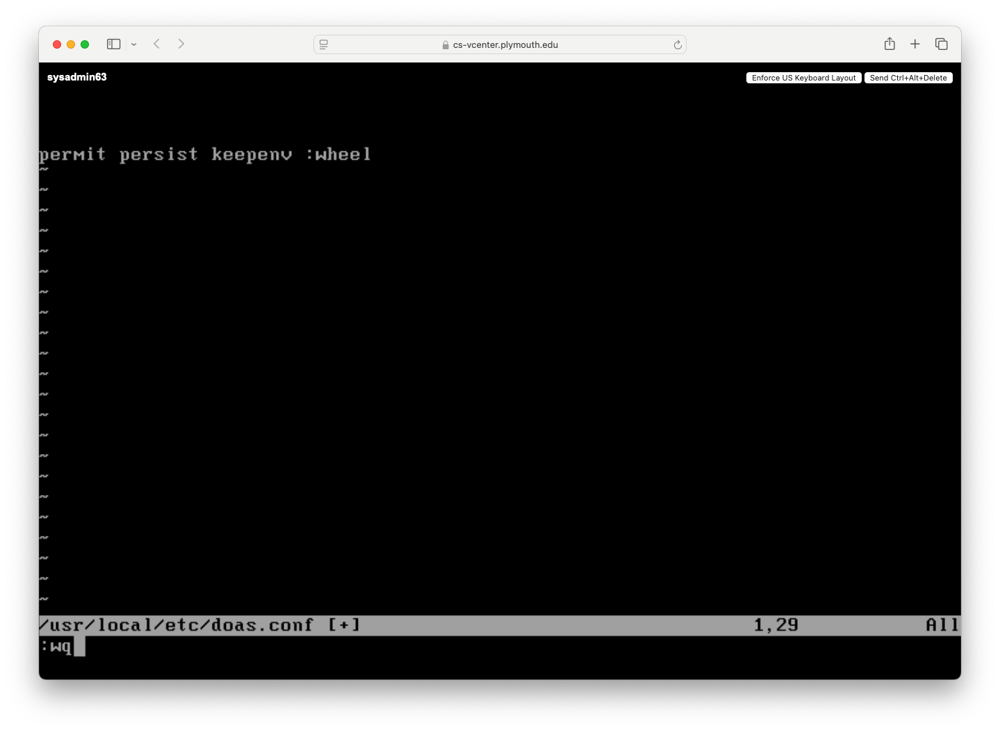

# System Administration Final Project

# TODO: Missing Adding Aditional User Step!

## Base Installation
The first step is to download the appropriate installation image for the appropriate architecture and storage medium for your server environment and flash it. Once you have booted into the install select to open a shell.

Type the command 'geom disk list' to get a list of the disks available. Find the disk you plan to install on and type 'dd if=/dev/urandom of=/dev/[DRIVE NAME] bs=1M status=progress' This will randomize our disk, making it more difficult for an attacker to discern things.

Deselect the various additional components as we you will not need them. (Unless you intend to run Wine on your server, in which case, you should keep lib32.)

Encrypt the disk, and encrypt the sway. In our case, we opt for the default 'stripe' option on the next page as we are using SLED and not RAID, but your circumstances may differ.

As we intend to have a server that is openly facing the internet, we will want to make sure that our time is in sync.

Enable all system hardening measures except for 'syslogd,' for remote logging. 

## Graphical and User Interface
Install the following list of packages. These are intended just as a base set of user applications which can enable a usable experience.

Enable 'seatd' as it will be required by sway. Vi into '/usr/local/etc/doas.conf'

Type 'i' to enter instertion mode. Then type the following. Hit the 'Esc' key to exit insertion mode. Then type ':wq + Enter' to save the file.

Now, as your regular user type 'chsh'

Use your arrow key to move down to the line containing your shell (aka '/bin/sh') and type 'x' until that portion goes away. Then type 'i' to enter insertion mode just like we did above and put in the following path to your new shell. Write and exit.

Clone, copy over, and delete your dotfiles configuration.

Now, when you reboot the machine using 'doas reboot', you will login to your new ZSH configuration, and seatd will be running.

Now, you can enter sway by simply typing 'sway'

