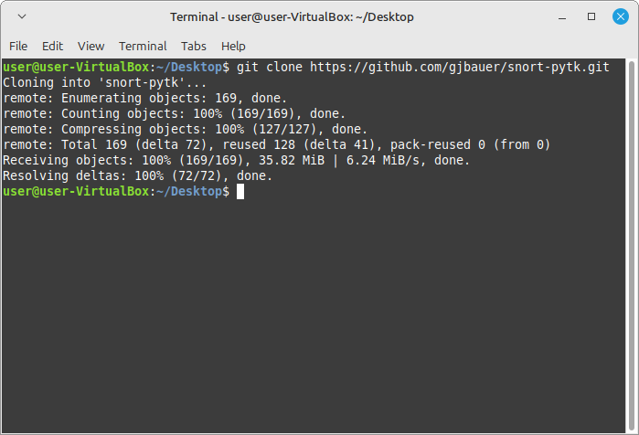
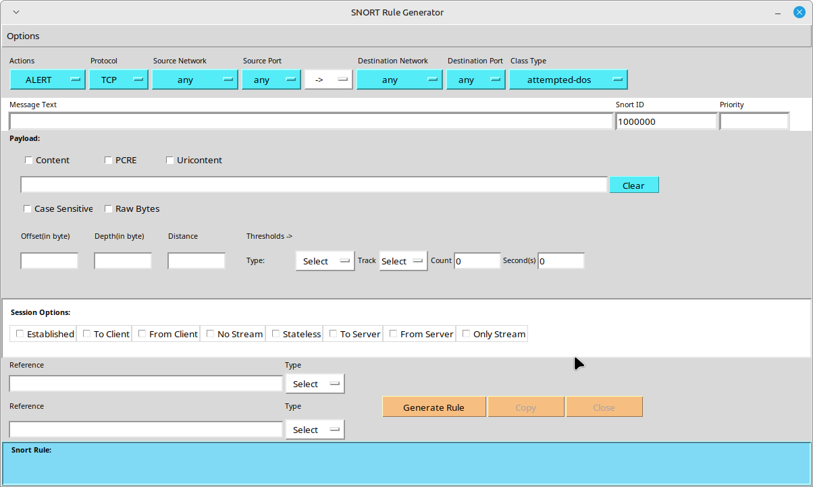

# System Administration Final Project

## Base Installation
The first step is to download the appropriate installation image for the appropriate architecture and storage medium for your server environment and flash it. Once you have booted into the install select to open a shell.

Type the command 'geom disk list' to get a list of the disks available. Find the disk you plan to install on and type 'dd if=/dev/urandom of=/dev/[DRIVE NAME] bs=1M status=progress' This will randomize our disk, making it more difficult for an attacker to discern how much disk space is actively being used (a fact that was previously mentioned on the Full Disk Encryption page of the OpenBSD Handbook before the page was taken down.)

Deselect the various additional components as we you will not need them. (Unless you intend to run Wine on your server, in which case, you should keep lib32.)

Encrypt the disk, and encrypt the swap. In our case, we opt for the default 'stripe' option on the next page as we are using SLED and not RAID, but your circumstances may differ.

As we intend to have a server that is openly facing the internet, we will want to make sure that our time is in sync.

Enable all system hardening measures except for 'syslogd,' for remote logging. 

When prompted to add users select 'yes.'

Be sure to add your user to both the wheel and video groups.

## Graphical and User Interface
Install the following list of packages. These are intended just as a base set of user applications which can enable a usable experience. Personally, I recommend installing Firefox (or Brave) instead for a slightly more secure browsing experience based upon memory-safe Rust.

Enable 'seatd' as it will be required by sway. Vi into '/usr/local/etc/doas.conf'

Type 'i' to enter instertion mode. Then type the following. Hit the 'Esc' key to exit insertion mode. Then type ':wq + Enter' to save the file.

Now, as your regular user type 'chsh'

Use your arrow key to move down to the line containing your shell (aka '/bin/sh') and type 'x' until that portion goes away. Then type 'i' to enter insertion mode just like we did above and put in the following path to your new shell. Write and exit.

Clone, copy over, and delete your dotfiles configuration.

Now, when you reboot the machine using 'doas reboot', you will login to your new ZSH configuration, and seatd will be running.

Now, you can enter sway by simply typing 'sway'

### Why a GUI?
Well, this is certainly a good question as we are theoretically intending this machine to only run as a server. A short answer is that Snort is a piece of software with a lot of different features and I did not spend the time when preparing this presentation to fully immerse myself in the documentation for this piece of software, so it was easier to modify an existing piece of software which I had found on Github which provided a friendly user interface to generate rules for the daemon. A full-time system admin might want to spend some more time reading the official documentation in order to better understand how to best incorporate Snort into their *specific* use case.
## Web Server and Firewall
This would be a good time to install the web server and firewall of your choice. Personally, I am partial to NGINX, but decided to use Apache for this demo.
## Snort
### A little caveat
Just as a little note here, the FreeBSD installation which I had spun up in the first part is running on VMWare, and I am unable to make any configuration changes nor install any graphics drivers that allow Wayland to actually function properly on this platform, though most people should almost never run into this situation when running either on real world hardware or an alternative virtual machine environment (I recommend 'libvirt' and 'virt-manager', personally.) All of that is to say that the rest of this was completed on a Linux Mint VM.

Start by installing snort through your package manager.

Then clone the GitHub repository for the GUI.

'cd' into the sub-directory containing the installer. 'chmod' it to give it executable permissions and run it.

After entering the main application, open the rules generator. The only thing we need to do for this simple demo is to set the following settings on the blue space at the top. Opt to create an alert for both denial-of-service as well as attempted-dos.

Here I have a webpage opened in the background to my Apache server homepage. And I am choosing to run Snort for 6 minutes. 

Finally, I run the exploit script and open the log analyzer after it completes...

## Rkhunter
Another way that we can check for any potential compromises in our system is to run a piece of software called "rkhunter." Wikipedia describes rkhunter as follows: "rkhunter (Rootkit Hunter) is a Unix-based tool that scans for rootkits, backdoors and possible local exploits. It does this by comparing SHA-1 hashes of important files with known good ones in online databases, searching for default directories (of rootkits), wrong permissions, hidden files, suspicious strings in kernel modules, and special tests for Linux and FreeBSD." Rkhunter can be installed on your FreeBSD installation by typing 'doas pkg install rkhunter' as an unprivileged user or simply 'pkg install rkhunter' as a prviliged user. Once installed a priviliged user, or a non-privileged user (in the wheel group) using the 'doas' command can perform a system scan by running the command 'rkhunter -c.' Upon completion, you should get an output similar to that which you can see below from my scan that I ran on my Linux Mint VM.

